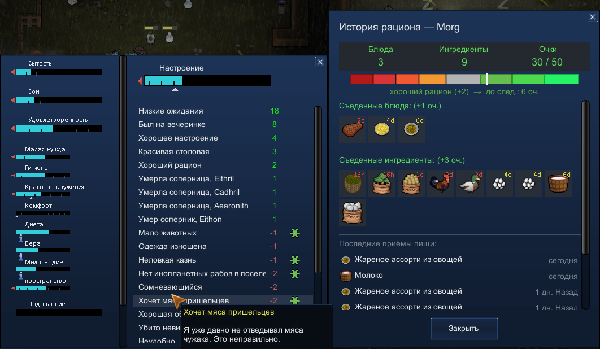
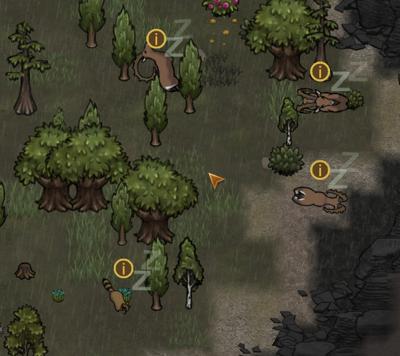

# HSK Diet Tracker

**[Native] [1.5 & 1.6]**

Have you ever wondered why you need food variety in RimWorld when you can just eat rice and cook only one meal? This mod spices up your gameplay with dishes and ingredients. Now colonists want diverse food and remember what they ate over the last 7 days. Variety boosts their mood, while monotony makes them miserable =)

Colonists who suddenly appear on the map get a 3-day grace period (no penalties or bonuses), since they haven't adjusted to the colony's food yet.
Required variety depends on the tech level and biome.

Unlike Variety Matters:
- Visually clear scoring system.
- Tracks meals and ingredients over a week, not the last N eaten.

## Screenshots

## Requirements
- RimWorld 1.5 / 1.6
- Hardcore SK modpack
- Harmony
